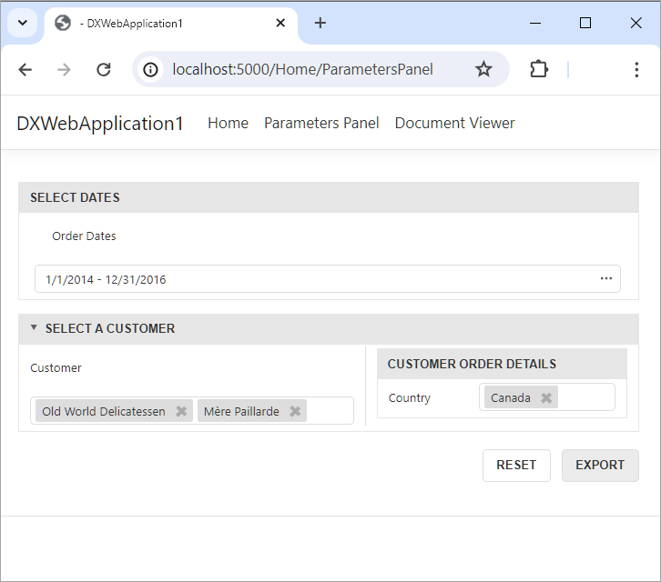

<!-- default badges list -->

<!-- default badges end -->
# Reporting for ASP.NET Core - Standalone Report Parameters Panel

This example uses the standalone DevExpress Report Parameters Panel in an ASP.NET Core-powered application.

The application includes two pages: one with the standalone Report Options Panel and the other with the DevExpress Document Viewer. Both pages load the same sample report.

The report is a list of invoices from the Northwind database. It includes parameters created with our Visual Studio Report Designer – parameters that are used to filter report data.

Parameter Panel layout is created in code in the report class constructor using the [ParameterPanelFluentBuilder](https://docs.devexpress.com/XtraReports/DevExpress.XtraReports.Parameters.ParameterPanelFluentBuilder) class . 

A model for the standalone Report Parameters Panel component is created in the **ParametersPanel** controller action on the server. The model contains a report instance with necessary layout information (which is subsequently retrieved by the standalone Report Parameters Panel). Parameters Panel layout information is stored in the [XtraReport.ParameterPanelLayoutItems](https://docs.devexpress.com/XtraReports/DevExpress.XtraReports.UI.XtraReport.ParameterPanelLayoutItems) collection.

Client-side JavaScript code adds an Export button to the standalone Report Parameters Panel component. When the user clicks the button, a request to the **ExportReport** controller action is executed, and the resulting PDF file is sent to the client.

## Files to Review

- [ParametersPanelReport.cs](CS/DXWebApplication1/PredefinedReports/ParametersPanelReport.cs)
- [HomeController.cs](CS/DXWebApplication1/Controllers/HomeController.cs)
- [ParametersPanel.cshtml](CS/DXWebApplication1/Views/Home/ParametersPanel.cshtml)

## Documentation

- [Standalone Report Parameters Panel](https://docs.devexpress.com/XtraReports/404883/web-reporting/standalone-parameters-panel)
- [Standalone Report Parameters Panel in ASP.NET Core Applications](https://docs.devexpress.com/XtraReports/404888/web-reporting/asp-net-core-reporting/standalone-parameters-panel-asp-net-application/add-the-standalone-parameters-panel-to-asp-net-core-application)
- [How to Use Parameter Values from the Standalone Report Parameters Panel (ASP.NET Core App)](https://docs.devexpress.com/XtraReports/404889/web-reporting/asp-net-core-reporting/standalone-parameters-panel-asp-net-application/send-parameters-from-panel-to-server)
<!-- feedback -->
## Does this example address your development requirements/objectives?

 

(you will be redirected to DevExpress.com to submit your response)
<!-- feedback end -->
